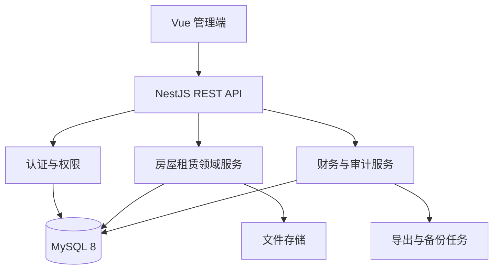

# SRMS 房屋租赁管理系统 PRD 与 Codex 开发交接方案（V1.0）

> 产品：Smart Rental Management System（SRMS）  
> 文档版本：1.0  
> 需求基线：`SRMS-RB-1.0`  
> 编制日期：2026-07-21  
> 状态：需求已冻结，Task001 已完成，等待从 Task002 开发  
> Windows 项目目录：`D:\Work\iwen-codex\codex-zhufang\srms`

## 1. 文档目的与效力

本文档用于把 SRMS 第一版完整交接给 Codex，覆盖产品需求、功能模块、技术方案、工程目录、风险、开发顺序和验收方式。Codex 应以本文档建立全局认知，再按指定的详细设计逐个 Task 实施。

需求冲突时按以下顺序裁决：

1. 最新已批准需求变更单（CR）。
2. `docs/requirements-freeze-v1.md`。
3. 本 PRD。
4. 对应模块详细设计。
5. `docs/database-design.md`。
6. HTML/图片原型。

原型仅表达界面与交互，不得以原型漏画为由删除文字需求。未经批准，不得自行改变角色权限、状态流转、金额口径、审批流程、数据结构或统计口径。

## 2. 项目背景与目标

### 2.1 背景

项目用于集中管理 1 栋、2 栋的住宅与商铺，解决房源状态分散、合同账期难追踪、收款与欠租口径不清、押金退租缺少闭环、财务统计和敏感操作不可追溯等问题。

### 2.2 产品目标

- 建立“房源—承租人—合同—账单—收款—退租”完整业务链。
- 准确支持固定月租、自定义阶梯计价、免租、优惠减免、部分付款、多月付款、预收款和退差。
- 区分应收、实收、优惠、退款、押金、预收款及内部抵扣，保证财务口径一致。
- 通过角色权限、审批、不可删除审计记录和备份恢复，降低误操作与越权风险。
- 提供清晰的房态、催租、欠租、合同到期和财务经营视图。

### 2.3 第一版成功标准

- 用户可从房源建档开始，完整完成签约、出账、收款、退租和押金退还。
- 所有金额业务可由不可覆盖的明细或流水追溯，不依赖直接修改余额。
- 管理员无法查看任何提成数据，也不能绕过后端权限访问财务中心或安全审计。
- 关键财务事务在并发、重复提交或失败时不产生重复流水、负余额或半完成状态。
- 生产构建、单元测试、接口测试、权限测试、Prisma 校验和关键流程回归全部通过。

## 3. 用户角色与权限边界

| 角色 | 定位 | 核心权限 | 明确限制 |
| --- | --- | --- | --- |
| 超级管理员 | 系统所有者与财务负责人 | 全部业务、财务中心、提成、用户、系统参数、审计、备份恢复；可直接修改已确认收款但必须留痕 | 不得删除最后一名启用的超级管理员；不得修改或删除安全审计日志 |
| 管理员 | 日常房屋与收款经办 | 房源、承租人、合同、账单、收款；发起优惠、退款/作废、退差、押金退还等申请 | 不得访问财务中心、提成、安全审计和系统管理；不能直接修改已确认收款 |
| 游客 | 只读业务查看 | 仅查看授权的非敏感业务信息 | 无新增、修改、审批、财务、提成、日志和导出敏感数据权限 |

权限必须由后端守卫、服务层数据范围和响应字段白名单共同执行，前端隐藏菜单只作为用户体验，不作为安全措施。

## 4. 产品范围

### 4.1 第一版包含

- 登录、会话、三类角色与权限。
- 驾驶舱和楼栋房态图。
- 楼栋与房源管理。
- 个人/单位承租人及证件资料。
- 合同、主副承租人、固定租期、合同变更和文件。
- 固定月租、自定义阶梯计价、免租和优惠减免。
- 固定租期账单快照、部分付款、多月付款和预收款。
- 收款、分配、收据、退款、作废及审批。
- 阶梯退差与固定月租人工协商退差。
- 押金、退租结算、扣款和押金退还。
- 财务总览、租金收缴报表、资金流水、Excel/PDF 导出。
- 仅超级管理员可见的租房提成台账。
- 用户管理、系统设置、操作日志、安全审计、备份恢复。

### 4.2 第一版不包含

- 水费、电费及其他物业计费。
- 在线支付、支付平台回调和自动对账。
- 发票管理。
- 多公司、多租户 SaaS。
- 已出售房源的新合同或代管出租。
- 提成比例、自动计算、审批或付款流程。

## 5. 核心业务需求

### 5.1 房源

- 房源记录楼栋、房号、自动生成的完整房号、楼层、住宅/商铺类型、面积、装修状态、用途、房态、业主展示信息和备注。
- 房态至少包含：空置、待入住、已出租、待退房、维修中、待出售、已出售、停用、其他。
- 待出售、已出售、停用不计入可经营房源；存在未结束合同的房源不能转为这些状态。
- 所有房态变化写入历史，驾驶舱支持按楼栋及多状态筛选，并允许用户保存默认筛选。

### 5.2 承租人与合同

- 承租人默认为个人，也支持单位；证件号码加密存储，另存摘要用于精确查重和末四位用于脱敏展示。
- 一份合同只对应一个房源，必须且只能有一名主承租人，可有多名副承租人。
- 合同采用固定租期，缴费不延长合同；合同日期重叠检查必须在事务内完成。
- 账期按合同开始日每满一个月划分，尾期不足月按日计租。
- 缴租周期可配置 1—12 个月，但一次实际收款可以覆盖任意数量账期。
- 合同支持固定月租、合同级自定义阶梯租价、免租和优惠减免。
- 合同生效时复制计价快照并生成租期内账单快照，后续模板变化不得影响历史合同。

### 5.3 账单、收款和预收款

- 一笔收款可分配到多张账单，默认先冲抵最早未结清账单，也可选择未来账单。
- 金额不足形成部分付款；超过选中账单合计的余额进入合同预收款。
- 一笔收款只生成一个收款单号和一张收据，收据列明各覆盖账期。
- 原应收、已确认优惠、有效实收和欠款必须分开记录。
- 优惠/减免必须填写类型、金额、适用账单和原因；管理员提交，超级管理员确认，确认前不得减少净应收。
- 管理员不能改已确认收款，只能申请整笔作废后重录；超级管理员确认作废。超级管理员直接修改收款时必须填写原因并保存前后值。
- 部分退款、整笔作废、优惠回退及账单恢复必须使用逆向流水，不删除原记录。

### 5.4 阶梯计价与退差

- 每份合同自由设置档位月数和各档月租，不使用固定的 1/3/6/12 月价格表。
- 达到合同约定档位后，系统计算参考差额，实际退差金额由经办人根据协商结果填写。
- 固定月租合同也可登记人工协商退差，但不生成阶梯参考金额。
- 管理员登记、超级管理员确认；可实际退款或转为预收款。实际退款必须上传凭证。
- 退差为补充记录，任何时候都不得覆盖原账单和原收款。

### 5.5 押金与退租

- 流程固定为：发起退租 → 验房与结算 → 押金退还确认 → 合同结束。
- 押金可抵扣欠租及双方确认的验房扣款；维修等扣款必须有验收依据。
- 结算自动计算应退押金和租客应补交金额，实际退租日后的未来账单作废。
- 押金退还不采集收款人、账户后四位或交易流水号；保留退款日期、方式和备注。
- 转账上传交易截图，现金上传签收凭证；管理员登记，超级管理员确认。
- 无可退押金时不得生成虚假退款记录。欠租、预收款、押金全部处理完成后合同才可结束。

### 5.6 财务、报表与提成

- 经营报表按账期统计；资金流水按实际收付日期统计，两种口径分开展示。
- 租金净应收 = 原应收 − 已确认免租/优惠 ± 已确认调整。
- 收租率 = 有效实收 ÷ 租金净应收；净应收为零的账单不进入分母。
- 押金和未分配预收款为负债，不计租金收入；优惠不是付款或现金流；押金抵扣不是外部现金流。
- 财务中心只有超级管理员可访问，支持财务总览、租金收缴、资金流水及受审计的 Excel/PDF 导出。
- 每条提成只包含合同、所属对象和金额，由超级管理员主观登记并可随时修改。
- 提成没有比例、基数、触发、审批、付款状态、日期、方式或凭证，不进入资金流水和任何租金统计。
- 管理员、游客的页面、接口、导出、搜索、统计均不得返回提成字段；新增、修改、删除必须永久审计。

### 5.7 系统管理与安全审计

- 系统始终至少保留一名启用状态的超级管理员；停用用户或重置密码后撤销其全部刷新令牌。
- 普通操作日志可查询、软隐藏和恢复；只有超级管理员可以隐藏/恢复，操作本身写入安全审计。
- 安全审计只追加，不提供更新或删除接口；高风险事件保存操作人、原因、对象和修改前后快照，并形成哈希链。
- 每日自动备份并保留最近 30 天；恢复前自动备份当前数据，恢复后强制全部用户重新登录。

## 6. 功能模块清单

| 模块 | 主要页面/能力 | 关键后端能力 | 主要角色 |
| --- | --- | --- | --- |
| 认证与会话 | 登录、退出、会话过期 | 密码哈希、JWT、刷新轮换、失败锁定 | 全部 |
| 用户与权限 | 用户列表、角色、停用、重置密码 | RBAC、最后超级管理员约束、令牌撤销 | 超级管理员 |
| 驾驶舱 | 指标、催租、欠租、到期、待审批、房态图 | 聚合查询、个人默认筛选 | 按权限展示 |
| 房源 | 楼栋、房源列表/详情/状态历史 | 房态约束、经营口径、状态流转 | 超管/管理员；游客只读 |
| 承租人 | 个人/单位、证件、关联合同 | 加密、查重、脱敏、文件关联 | 超管/管理员；游客受限只读 |
| 合同与计价 | 新建、详情、变更、档位、免租 | 重叠校验、快照、账期生成 | 超管/管理员 |
| 账单与收款 | 账单、登记收款、收款详情、收据 | 分配事务、预收款、幂等编号 | 超管/管理员 |
| 优惠/退款/作废 | 申请、审核、逆向处理 | 状态机、逆向流水、审计 | 管理员发起/超管确认 |
| 退差 | 达标核验、人工退差、退款/转预收 | 参考计算、补充记录、凭证 | 管理员发起/超管确认 |
| 押金与退租 | 发起、验房结算、退还确认 | 抵扣、扣款、未来账单作废、合同结束 | 管理员发起/超管确认 |
| 财务中心 | 总览、租金报表、资金流水、导出 | 两套统计口径、字段隔离 | 仅超级管理员 |
| 提成台账 | 查询、新增、修改、删除、导出 | 合同附属金额、永久审计 | 仅超级管理员 |
| 文件 | 证件、合同、收付款凭证 | 类型/大小校验、权限下载、元数据 | 随业务权限 |
| 系统与审计 | 参数、日志、备份恢复 | 哈希链、软隐藏、备份校验、会话失效 | 仅超级管理员为主 |

## 7. 非功能需求

### 7.1 安全

- 密码使用 Argon2id 或 bcrypt 哈希，禁止存储或记录明文密码。
- JWT 访问令牌短期有效；刷新令牌轮换，数据库只保存其哈希。
- 证件号码加密存储，接口和日志默认脱敏；密钥只来自环境变量。
- DTO 白名单校验、参数化查询、上传类型与大小校验、CORS 白名单及统一异常处理。
- 敏感接口以后端角色守卫和字段白名单为准，特别是财务、提成、导出、审计、备份。
- `.env`、真实承租人资料、交易截图、备份文件不得提交到 Git 或出现在日志/测试夹具中。

### 7.2 一致性与精度

- 数据库存储金额使用 `DECIMAL(14,2)`；Node.js 业务层不得用普通浮点数做金额运算。
- 收款、分配、预收款、退款、押金抵扣、结算等操作必须处于单一数据库事务。
- 财务与合同关键表使用 `version` 乐观锁；写接口使用幂等键或等效机制防重复提交。
- 所有余额可由不可覆盖流水重建；主表余额仅作缓存并需要一致性校验。
- 业务日期按 `Asia/Shanghai` 计算，数据库操作时间统一存 UTC。

### 7.3 性能与可维护性

- 所有列表必须分页，常用筛选建立组合索引，驾驶舱与财务查询避免 N+1。
- 慢导出和备份使用任务记录；下载前再次校验权限，临时地址短期有效。
- API 统一返回 `{ code, message, data }`，错误码稳定且可测试。
- 数据库结构变更全部通过 Prisma Migration，禁止直接改生产表。
- 业务规则集中在后端领域服务，不在 Controller 或 Vue 页面中重复实现核心金额公式。

### 7.4 测试与质量门槛

- 每个 Task 同时完成数据库、后端、前端和测试，不留下只有页面没有真实接口的功能。
- 后端至少包含领域单元测试、权限测试和关键事务接口测试；金额链路覆盖正常、边界、重复提交、并发和回滚。
- 每个 Task 完成后执行：生产构建、单元测试、接口测试、ESLint、Prisma 校验。
- 合同—账单—收款—退租主链路在发布前执行端到端回归。

## 8. 技术方案

### 8.1 技术栈

| 层级 | 方案 |
| --- | --- |
| 前端 | Vue 3、TypeScript、Element Plus、Vue Router、Pinia、Axios、Vite |
| 后端 | NestJS、TypeScript、class-validator、Passport/JWT |
| 数据库/ORM | MySQL 8、Prisma、Migration |
| 导出 | ExcelJS、pdf-lib |
| 部署 | Docker Compose；Nginx 承载前端静态文件 |
| 运行环境 | Node.js 24 LTS、npm 11+ |

### 8.2 总体架构



第一版采用模块化单体，保持事务简单和部署成本可控。不得在第一版提前拆微服务；模块之间通过明确的服务接口协作，避免跨模块直接修改数据。

### 8.3 后端模块建议

- `auth`：登录、刷新、退出、会话撤销、失败锁定。
- `users` / `authorization`：用户、角色守卫、数据范围。
- `buildings` / `rooms`：楼栋、房源、房态历史。
- `tenants` / `files`：承租人、加密脱敏、附件。
- `contracts` / `pricing` / `bills`：合同、计价快照、账期与调整。
- `payments` / `prepayments` / `rebates`：收款分配、退款作废、预收、退差。
- `deposits` / `checkouts`：押金流水、退租结算和退款。
- `finance` / `commissions` / `exports`：财务查询、提成隔离、导出。
- `dashboard`：跨域只读聚合。
- `settings` / `logs` / `audits` / `backups`：系统管理与安全治理。

### 8.4 关键实现策略

- 状态流转：用显式枚举与领域方法校验，不接受任意字符串更新状态。
- 金额计算：采用 Decimal 库/Prisma Decimal，统一四舍五入到两位；逐账单计算后汇总。
- 快照：合同生效时保存价格和账单快照，历史业务不随配置变化。
- 流水：收款、优惠、退款、预收、押金和退差以新增正向/逆向记录表达，不覆盖历史。
- 审批：申请与确认分开记录状态、操作人和时间；禁止发起人利用参数冒充审批人。
- 提成隔离：独立模块与 DTO，通用合同查询不包含提成 relation；只有超级管理员专用接口可访问。
- 文件：数据库只保存元数据和业务关联；物理文件使用不可预测文件名，下载时重新鉴权。
- 编号：通过 `number_sequences` 在事务内生成合同号、账单号、收款号、收据号和结算号。

## 9. 工程目录结构

### 9.1 当前已存在目录

```text
srms/
├─ frontend/                 Vue 3 前端骨架
├─ backend/                  NestJS + Prisma 后端骨架
├─ deploy/                   Docker Compose
├─ scripts/                  Windows/Unix 环境脚本
├─ docs/                     冻结需求与详细设计
├─ uploads/                  本地上传占位目录
├─ backups/                  本地备份占位目录
├─ package.json              根目录统一命令
└─ README.md                 启动说明与任务进度
```

### 9.2 开发后目标目录

```text
srms/
├─ frontend/
│  └─ src/
│     ├─ api/                按业务模块封装 API
│     ├─ assets/             静态资源
│     ├─ components/         通用组件
│     ├─ layouts/            主布局、登录布局
│     ├─ router/             路由与权限守卫
│     ├─ stores/             Pinia 会话和业务状态
│     ├─ types/              前端 DTO 与枚举
│     ├─ utils/              金额展示、日期、下载等
│     └─ views/              按模块分目录的页面
├─ backend/
│  ├─ prisma/
│  │  ├─ schema.prisma       数据模型
│  │  ├─ migrations/         只增不改的迁移历史
│  │  └─ seed.ts             首名超管及演示数据
│  ├─ src/
│  │  ├─ common/             守卫、装饰器、异常、拦截器、Decimal/时间工具
│  │  ├─ config/             环境配置与校验
│  │  ├─ modules/            按 8.3 划分的业务模块
│  │  ├─ prisma/             PrismaService 与事务支持
│  │  └─ main.ts
│  └─ test/                  e2e、权限矩阵和主链路测试
├─ deploy/                   本地及生产容器配置
├─ scripts/                  初始化、备份、恢复和验收脚本
├─ docs/                     PRD、冻结基线、详细设计、Task 验收记录
├─ uploads/                  运行期文件，不进 Git
├─ backups/                  运行期备份，不进 Git
└─ README.md
```

目录可以在不改变模块职责的前提下小幅调整；Codex 不得创建第二套平行前端、后端或数据库工程。

## 10. 数据与接口约定

- API 前缀为 `/api`；认证接口使用 `/api/auth/**`，管理接口按业务资源划分。
- 所有写请求使用 DTO 校验和字段白名单；分页请求统一 `page`、`pageSize`，响应返回列表及总数。
- HTTP 状态码表达协议结果，业务响应体统一为 `{ code, message, data }`。
- 列表/详情 DTO 按角色显式定义，不直接返回 Prisma 实体。
- 日期接口使用 ISO 8601；业务日期明确为 `YYYY-MM-DD`，金额以字符串传输以避免前端精度丢失。
- 删除业务数据默认为软删除；安全审计不可删除；财务流水禁止直接更新或删除。
- 详细表结构、索引、事务及统计口径以 `docs/database-design.md` 为准。

## 11. 风险点与控制措施

| 风险 | 可能后果 | 控制措施 | 验收重点 |
| --- | --- | --- | --- |
| 金额使用浮点数 | 一分钱误差、报表不平 | Decimal 全链路、逐账单取整、金额字符串 API | 多账期、尾期、退款和汇总测试 |
| 跨月/月底账期 | 1月31日起租等日期错误 | 明确锚定合同开始日，封装唯一账期算法 | 闰年、28/29/30/31日用例 |
| 并发或重复提交 | 重复收款、负余额 | 事务、乐观锁、幂等键、唯一业务号 | 并发集成测试与失败回滚 |
| 财务口径混用 | 应收、实收、现金流对不上 | 经营账期与实际收付两套查询分离 | 用预收、押金抵扣、退款数据核对 |
| 审批被绕过 | 管理员自行确认敏感操作 | 后端角色守卫、状态机、审批人记录 | 越权与伪造参数测试 |
| 提成泄露 | 敏感薪酬信息暴露 | 独立接口/DTO/查询，不在合同通用响应加载 | 管理员/游客接口字段快照测试 |
| 历史数据被覆盖 | 无法审计和对账 | 快照、正逆向流水、软删除、永久审计 | 修改/作废后原记录仍可追溯 |
| 文件越权或恶意上传 | 隐私泄露、系统风险 | 文件类型/大小校验、随机名、下载鉴权 | 跨合同下载和伪造扩展名测试 |
| 时区不一致 | 催租、到期、月报错日 | DB 存 UTC，业务统一 Asia/Shanghai | 日界线和月末测试 |
| 最后超管被停用 | 系统失去管理入口 | 数据库事务内校验，撤销令牌 | 并发停用两名超管测试 |
| 备份不可恢复 | 灾难时数据丢失 | 校验值、恢复演练、恢复前备份、附件清单 | 定期抽样恢复与会话强退 |
| 原型与文字不一致 | 漏开发冻结功能 | 冻结文字优先，Task 开始前列需求映射 | 验收矩阵逐项勾选 |
| 当前 Schema 不完整 | 后续迁移冲突 | 每 Task 单独 Migration，不手改已执行迁移 | 空库和已有库两种迁移验证 |

## 12. 开发顺序与 Task 划分

原则：每次只完成一个 Task；Task 内完成数据库、后端、前端、权限和测试；通过验收后再进入下一 Task。

| Task | 内容 | 前置依赖 | 核心交付与完成标准 |
| --- | --- | --- | --- |
| Task001 | 项目初始化 | 无 | 已完成：前后端骨架、MySQL/Prisma、Docker、脚本、构建和基础测试通过 |
| Task002 | 登录与会话 | Task001 | 首名超管初始化；登录、刷新轮换、退出/全部退出、失败锁定、登录页、会话 Store、路由保护及自动化测试 |
| Task003 | 用户与权限基础 | Task002 | 三角色 RBAC、用户管理、停用/重置、最后超管约束、字段级权限、菜单权限和越权测试 |
| Task004 | 楼栋与房源 | Task003 | 楼栋/房源 CRUD、房态历史、状态约束、筛选、详情页和房源权限测试 |
| Task005 | 承租人与文件基础 | Task003 | 个人/单位、加密查重/脱敏、证件附件、权限下载与测试 |
| Task006 | 合同、计价与账单 | Task004/005 | 主副承租人、固定租期、冲突校验、固定/阶梯计价、免租、快照、完整账单生成及日期金额测试 |
| Task007 | 收款、分配与预收款 | Task006 | 多账期/部分付款、最早欠款优先、未来账单、超额预收、收款详情、单张收据、事务/幂等测试 |
| Task008 | 优惠、退款与作废 | Task007 | 优惠申请审批、部分退款、整笔作废、逆向流水、超管修改收款、前后值审计和权限测试 |
| Task009 | 阶梯退差 | Task007/008 | 达标参考金额、人工实际金额、固定月租协商退差、退款/转预收、凭证和审批测试 |
| Task010 | 押金与退租 | Task006-009 | 押金流水、退租发起、结算明细/依据、抵扣、未来账单作废、退还确认、合同结束和全流程测试 |
| Task011 | 财务中心与提成 | Task007-010 | 财务总览、租金报表、资金流水、Excel/PDF；独立提成台账和严格字段隔离测试 |
| Task012 | 驾驶舱 | Task004-011 | 经营指标、7天催租、欠租、合同到期、待审批、房态图、默认筛选及统计口径测试 |
| Task013 | 系统设置、日志与备份 | Task003-012 | 参数、操作日志隐藏/恢复、安全审计哈希链、自动/手动备份、恢复强退和高风险验收 |
| Task014 | 集成验收与上线加固 | 全部 | 全链路 E2E、迁移验证、权限矩阵、安全检查、备份恢复演练、性能基线、部署文档和发布清单 |

不建议将驾驶舱提前实现为假数据页面；其统计依赖房源、合同、收款、审批和财务模块，放在主链路之后可避免重复返工。

## 13. 各阶段里程碑

- M1 基础安全可用（Task001—003）：系统可安全登录，权限边界可验证。
- M2 基础资料可用（Task004—005）：可维护真实房源和承租人。
- M3 租赁主链路可用（Task006—010）：可完成签约、出账、收款、调整、退租。
- M4 管理决策可用（Task011—013）：财务、驾驶舱、审计和备份齐备。
- M5 可发布（Task014）：全链路、迁移、权限、安全及恢复通过验收。

## 14. Codex 标准工作方式

### 14.1 每个 Task 开始前

1. 读取本 PRD、冻结基线、数据库设计和该模块详细设计。
2. 检查 `git status`、现有实现、Migration 与测试，不覆盖用户已有修改。
3. 输出简短的需求—代码映射和本 Task 计划；只有会改变冻结规则的问题才询问用户。
4. 当前 Task 之外的缺陷记录为待办，不顺手扩展到其他业务 Task。

### 14.2 实施要求

- 先定义数据约束与事务，再实现服务/API，最后接入前端页面。
- 所有权限以后端实际拒绝结果验收，不以按钮是否隐藏验收。
- 每个高风险写操作同时实现普通操作日志或安全审计。
- 新依赖应说明用途，避免引入与现有栈重复的大型框架。
- 不修改冻结基线；若发现矛盾，暂停对应规则并提交影响分析。

### 14.3 每个 Task 完成后

1. 执行 `npm run build`、`npm run test`、后端 e2e、`npm run lint`、`npm run db:validate`。
2. 在可用 MySQL 上执行 Migration，验证空库初始化和已有库升级。
3. 更新 README 任务状态，并新增 `docs/taskNNN-acceptance.md`，列出范围、测试结果、遗留项和手工验收步骤。
4. 提交 Git；若环境不允许，生成不含 `.env`、依赖、构建产物、上传文件和备份的源码快照。
5. 向用户报告完成结果、可验证入口、未决风险和下一 Task，不用重复整份需求。

## 15. Task002 接管指令（可直接交给 Codex）

```text
请接管 SRMS 项目，从 Task002“登录与会话”开始开发。

项目目录（Windows）：D:\Work\iwen-codex\codex-zhufang\srms
冻结需求版本：SRMS-RB-1.0
当前状态：Task001 已完成并通过代码侧验收，业务代码尚未开始。

开始前依次读取：
1. docs/SRMS-PRD-Codex-Handoff-v1.0.md
2. docs/requirements-freeze-v1.md
3. docs/database-design.md
4. docs/system-permissions-audit-design.md
5. docs/task001-acceptance.md
6. README.md、package.json 和当前前后端源码

严格执行：文字冻结需求优先于原型；每次只完成一个 Task；Task 内同时完成数据库、后端、前端、权限与测试；数据库变更使用 Prisma Migration；权限必须由后端落实；金额不得使用浮点数；不得读取、提交或展示密钥和真实业务资料。

Task002 必须交付：首名超级管理员初始化、用户名密码登录、安全密码哈希、JWT 短期访问令牌、刷新令牌哈希及轮换、退出和全部设备退出、连续失败锁定、最后登录时间、登录页、会话状态、路由保护，以及登录/失败/锁定/刷新/退出自动化测试。

先检查现有工作区并简要报告，再直接实施。只有遇到会改变冻结业务规则的选择时才向我提问。完成后执行完整质量检查，更新 README，建立 docs/task002-acceptance.md，并报告验收结果。
```

## 16. 参考设计文件

- `docs/requirements-freeze-v1.md`：第一版最高需求基线。
- `docs/database-design.md`：表、索引、事务和统计口径。
- `docs/system-permissions-audit-design.md`：权限、日志与备份。
- `docs/contract-pages-design.md`：合同新增、详情和退差页面。
- `docs/flexible-tier-pricing.md`：自定义阶梯计价。
- `docs/payment-pages-design.md`：收款、优惠、退款和作废。
- `docs/checkout-pages-design.md`：退租和押金退还。
- `docs/finance-center-design.md`：财务报表和提成台账。
- `docs/task001-acceptance.md`：当前工程验收状态。

## 17. 当前交接结论

- 需求基线已冻结，无需重新调研或确认已记录规则。
- Task001 已完成；当前 Prisma Schema 只有用户、刷新令牌和用户偏好等首批模型，业务表需在后续 Task 逐步迁移实现。
- 下一唯一开发入口为 Task002“登录与会话”。
- 本 PRD 不授权立即写业务代码；用户明确要求开始某一 Task 后，Codex 才进入实现。
