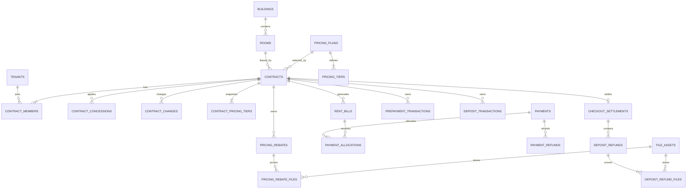

# SRMS 数据库详细设计（V1.0）

> 项目：Smart Rental Management System（房屋租赁管理系统）  
> 数据库：MySQL 8.0  
> ORM：Prisma  
> 文档状态：第一版冻结设计基线  
> 需求基线：`SRMS-RB-1.0`（2026-07-20）

## 1. 设计目标

数据库围绕“房源—承租人—合同—账单—收款—退租结算”主链路设计，并满足以下已确认规则：

- 一份合同只对应一个房源，每份合同必须且只能有一名主承租人。
- 合同采用固定租期，按合同开始日每满一个月形成账期。
- 支持整月、不足整月按日计租、免租和优惠。
- 支持合同级自定义弹性阶梯计价：档位月数、每档月租和实际退差金额均可按合同录入。
- 支持一次缴纳多个月、部分付款和预收款。
- 普通管理员只能作废错误收款后重录；超级管理员可以修改已确认收款，但必须留下前后值和原因。
- 押金独立管理，退还必须上传凭证，由管理员登记、超级管理员确认。
- 退租结算完成且押金、欠租、预收款全部处理后，合同才可结束。
- `已出售`房源只保留房源状态和业主展示，不提供合同、收款或代管出租功能。
- `待出售`、`已出售`、`停用`不计入可经营房源。
- 业务数据统一软删除；安全审计记录不可删除。
- 第一版不设计水费、电费、在线支付、发票和多公司 SaaS。

## 2. 数据库统一规范

### 2.1 基础规范

| 项目 | 规范 |
|---|---|
| 字符集 | `utf8mb4` |
| 排序规则 | `utf8mb4_0900_ai_ci` |
| 存储引擎 | InnoDB |
| 主键 | `INT UNSIGNED AUTO_INCREMENT` |
| 金额 | `DECIMAL(14,2)`，禁止使用 FLOAT/DOUBLE |
| 比例 | `DECIMAL(7,4)`，例如九折保存为 `0.9000` |
| 业务日期 | `DATE`，例如合同开始日、账单到期日 |
| 操作时间 | `DATETIME(3)`，数据库统一存 UTC |
| 业务时区 | 页面与业务计算使用 `Asia/Shanghai` |
| 软删除 | `deleted_at DATETIME(3) NULL` |
| 并发控制 | 财务和合同关键表使用 `version INT` 乐观锁 |

### 2.2 通用字段

除流水、关联表等特殊表外，业务主表默认包含：

| 字段 | 类型 | 说明 |
|---|---|---|
| id | INT UNSIGNED | 主键 |
| created_at | DATETIME(3) | 创建时间 |
| created_by | INT UNSIGNED NULL | 创建人 |
| updated_at | DATETIME(3) | 更新时间 |
| updated_by | INT UNSIGNED NULL | 最后修改人 |
| deleted_at | DATETIME(3) NULL | 软删除时间 |
| deleted_by | INT UNSIGNED NULL | 删除人 |
| version | INT | 乐观锁版本，默认1 |

### 2.3 金额与余额原则

- 所有余额都由不可覆盖的流水记录计算产生。
- 主表可以保存汇总余额以提高查询速度，但流水是最终依据。
- 收款、分配、退款、押金抵扣必须在同一数据库事务中完成。
- 金额四舍五入到两位小数；每张账单独立计算后再汇总。
- 账单实收金额不得小于0，也不得超过应收金额。
- 预收款、押金余额不得出现负数。

## 3. 数据域和表清单

| 数据域 | 表名 | 用途 |
|---|---|---|
| 用户权限 | users | 系统用户与角色 |
| 用户权限 | auth_refresh_tokens | 登录刷新令牌 |
| 用户权限 | user_preferences | 驾驶舱默认筛选等个人偏好 |
| 房源 | buildings | 楼栋基础信息 |
| 房源 | rooms | 住宅、商铺及业主展示信息 |
| 房源 | room_status_histories | 房源状态变化历史 |
| 承租人 | tenants | 个人或单位承租人 |
| 合同 | contracts | 合同主表 |
| 合同 | contract_members | 主承租人、副承租人 |
| 合同 | contract_changes | 租金、租期等合同变更 |
| 合同 | contract_concessions | 免租与优惠规则 |
| 合同 | contract_commissions | 仅超级管理员可见的租房提成记录 |
| 阶梯计价 | pricing_plans | 弹性租期阶梯价格方案 |
| 阶梯计价 | pricing_tiers | 方案中的标准价格档位 |
| 阶梯计价 | contract_pricing_tiers | 合同生效时复制的价格快照 |
| 阶梯计价 | pricing_rebates | 达标后的追溯退差单 |
| 账单 | rent_bills | 合同租期内的租金账单 |
| 账单 | bill_adjustments | 账单调整明细 |
| 收款 | payments | 实际收款记录 |
| 收款 | payment_allocations | 收款到账单的分配明细 |
| 收款 | payment_refunds | 租金收款退款 |
| 收款 | payment_void_requests | 已确认收款的作废申请与审批 |
| 预收款 | prepayment_transactions | 预收款余额流水 |
| 押金 | deposit_transactions | 押金收取、抵扣、退还流水 |
| 押金 | deposit_refunds | 押金退还登记与确认 |
| 退租 | checkout_settlements | 退租结算单 |
| 退租 | checkout_settlement_items | 欠租、维修等结算项目与依据 |
| 文件 | file_assets | 文件元数据 |
| 文件 | tenant_files | 承租人证件关联 |
| 文件 | contract_files | 合同扫描件关联 |
| 文件 | payment_files | 普通付款凭证关联 |
| 文件 | deposit_refund_files | 押金退还凭证关联 |
| 文件 | pricing_rebate_files | 阶梯退差退款凭证关联 |
| 导入导出 | import_tasks | Excel导入任务 |
| 导入导出 | import_task_errors | 导入错误明细 |
| 导入导出 | export_tasks | Excel/PDF导出任务 |
| 系统 | system_settings | 系统参数 |
| 系统 | operation_logs | 可查询、可软删除的操作日志 |
| 系统 | security_audit_logs | 永久保留的安全审计日志 |
| 系统 | backup_records | 数据备份记录 |
| 系统 | number_sequences | 合同、收据等业务编号序列 |

## 4. 核心实体关系



## 5. 用户与权限

### 5.1 users

| 字段 | 类型 | 必填 | 说明 |
|---|---|---:|---|
| username | VARCHAR(50) | 是 | 登录名，唯一 |
| password_hash | VARCHAR(255) | 是 | Argon2id 或 bcrypt 哈希 |
| display_name | VARCHAR(50) | 是 | 显示姓名 |
| role | ENUM | 是 | `SUPER_ADMIN`、`ADMIN`、`VISITOR` |
| phone | VARCHAR(30) | 否 | 联系电话 |
| status | ENUM | 是 | `ACTIVE`、`DISABLED`、`LOCKED` |
| failed_login_count | INT | 是 | 连续失败次数，默认0 |
| locked_until | DATETIME(3) | 否 | 锁定截止时间 |
| last_login_at | DATETIME(3) | 否 | 最后登录时间 |

约束与索引：

- `UNIQUE(username)`。
- 至少保留一个启用状态的超级管理员。
- 用户被停用后，立即撤销其全部刷新令牌。

### 5.2 auth_refresh_tokens

保存刷新令牌哈希，不保存令牌明文。字段包括 `user_id`、`token_hash`、`expires_at`、`revoked_at`、`ip_address`、`user_agent`。

### 5.3 user_preferences

| 字段 | 类型 | 说明 |
|---|---|---|
| user_id | INT UNSIGNED | 用户，唯一 |
| dashboard_building_id | INT UNSIGNED NULL | 驾驶舱默认楼栋 |
| dashboard_room_statuses | JSON NULL | 房态图默认多选状态 |
| dashboard_month_mode | ENUM | `CURRENT_MONTH` 或 `LAST_SELECTED` |

房态图第一次打开默认选择全部状态。用户点击“设为默认”后写入本表，跨设备生效。

## 6. 房源设计

### 6.1 buildings

| 字段 | 类型 | 必填 | 说明 |
|---|---|---:|---|
| building_no | VARCHAR(20) | 是 | 例如 `1栋` |
| building_name | VARCHAR(100) | 否 | 楼栋名称 |
| floor_count | INT | 是 | 楼层数，当前为6 |
| sort_order | INT | 是 | 驾驶舱显示顺序 |
| status | ENUM | 是 | `ACTIVE`、`DISABLED` |
| remark | VARCHAR(500) | 否 | 备注 |

`UNIQUE(building_no, deleted_at)`在MySQL中不适合直接保证软删除唯一性，建议增加 `active_unique_key` 生成列或由服务层在事务中校验。

### 6.2 rooms

| 字段 | 类型 | 必填 | 默认值 | 说明 |
|---|---|---:|---|---|
| building_id | INT UNSIGNED | 是 | — | 所属楼栋 |
| house_no | VARCHAR(30) | 是 | — | 房号，例如101 |
| full_house_no | VARCHAR(60) | 是 | 自动生成 | 例如1栋101，不允许手填 |
| floor_no | INT | 是 | — | 所在楼层 |
| room_type | ENUM | 是 | `RESIDENTIAL` | `RESIDENTIAL`住宅、`SHOP`商铺 |
| area | DECIMAL(10,2) | 否 | — | 建筑面积 |
| decoration_status | ENUM | 是 | `UNKNOWN` | `RENOVATED`、`UNRENOVATED`、`RENOVATING`、`UNKNOWN` |
| usage_type | ENUM | 是 | 自动 | `RESIDENCE`、`SHOP`、`OFFICE`、`STORAGE`、`OTHER` |
| room_status | ENUM | 是 | `EMPTY` | 见房源状态表 |
| status_changed_at | DATETIME(3) | 是 | 当前时间 | 状态开始时间 |
| owner_name | VARCHAR(100) | 否 | — | 业主姓名，仅展示 |
| owner_phone | VARCHAR(30) | 否 | — | 业主联系电话 |
| owner_remark | VARCHAR(500) | 否 | — | 业主备注 |
| remark | VARCHAR(500) | 否 | — | 房源备注 |

房源状态枚举：

| 枚举值 | 中文 | 可经营 | 允许新建合同 |
|---|---|---:|---:|
| EMPTY | 空置 | 是 | 是 |
| PENDING_MOVE_IN | 待入住 | 是 | 已有未来合同，不可再建冲突合同 |
| RENTED | 已出租 | 是 | 否 |
| PENDING_CHECKOUT | 待退房 | 是 | 否 |
| MAINTENANCE | 维修中 | 是 | 否 |
| DISABLED | 停用 | 否 | 否 |
| FOR_SALE | 待出售 | 否 | 否 |
| SOLD | 已出售 | 否 | 否，且无合同入口 |
| OTHER | 其他 | 由超级管理员明确 | 默认否 |

关键约束：

- `UNIQUE(building_id, house_no)`，仅对未删除记录生效。
- `full_house_no`由后端根据楼栋与房号生成。
- `SOLD`和`FOR_SALE`房源不能创建合同、账单、收款或代管关系。
- 存在未结束合同的房源不能改为`SOLD`、`FOR_SALE`或`DISABLED`。
- 出租率分母包括 `EMPTY`、`PENDING_MOVE_IN`、`RENTED`、`PENDING_CHECKOUT`、`MAINTENANCE`。

建议索引：

- `idx_rooms_building_floor(building_id, floor_no, house_no)`：楼栋房态图。
- `idx_rooms_status(room_status, deleted_at)`：状态统计与筛选。
- `idx_rooms_decoration(decoration_status, deleted_at)`：装修状态筛选。
- `idx_rooms_type_status(room_type, room_status)`：住宅/商铺经营分析。

### 6.3 room_status_histories

字段包括 `room_id`、`from_status`、`to_status`、`change_reason`、`business_type`、`business_id`、`changed_at`、`changed_by`。

任何房源状态变化必须写入本表，不能只覆盖 `rooms.room_status`。

## 7. 承租人设计

### 7.1 tenants

| 字段 | 类型 | 必填 | 默认值 | 说明 |
|---|---|---:|---|---|
| tenant_type | ENUM | 是 | `INDIVIDUAL` | `INDIVIDUAL`个人、`COMPANY`单位 |
| name | VARCHAR(100) | 是 | — | 姓名或单位名称 |
| phone | VARCHAR(30) | 否 | — | 标准化手机号 |
| id_type | ENUM | 否 | `ID_CARD` | 身份证、护照、统一社会信用代码等 |
| id_no_ciphertext | TEXT | 否 | — | 证件号码加密保存 |
| id_no_hash | CHAR(64) | 否 | — | 精确查重用HMAC摘要 |
| id_no_last4 | CHAR(4) | 否 | — | 脱敏展示 |
| contact_address | VARCHAR(300) | 否 | — | 联系地址 |
| status | ENUM | 是 | `ACTIVE` | `ACTIVE`、`INACTIVE` |
| remark | VARCHAR(500) | 否 | — | 备注 |

身份证完整值只在授权接口中解密，查看行为写入操作日志。游客只能获得脱敏字段。

## 8. 合同设计

### 8.1 contracts

| 字段 | 类型 | 必填 | 说明 |
|---|---|---:|---|
| contract_no | VARCHAR(40) | 是 | 系统合同编号，唯一，例如HT2026070001 |
| external_contract_no | VARCHAR(80) | 否 | 纸质或外部合同编号 |
| previous_contract_id | INT UNSIGNED | 否 | 续签来源合同 |
| room_id | INT UNSIGNED | 是 | 一份合同一个房源 |
| start_date | DATE | 是 | 合同开始日期 |
| end_date | DATE | 是 | 合同结束日期，当天计租 |
| planned_move_in_date | DATE | 否 | 计划入住日期 |
| actual_move_in_date | DATE | 否 | 实际入住日期 |
| actual_checkout_date | DATE | 否 | 实际退房日期 |
| monthly_rent | DECIMAL(14,2) | 是 | 月租 |
| pricing_mode | ENUM | 是 | `FIXED`固定月租、`TIERED_RETROACTIVE`弹性阶梯计价 |
| pricing_plan_id | INT UNSIGNED | 否 | 可选价格模板；合同可在模板基础上自由修改 |
| current_pricing_tier_id | INT UNSIGNED | 否 | 当前已达标档位，关联合同价格快照 |
| qualified_months | INT | 是 | 已满足的连续完整账期数，默认0 |
| next_tier_date | DATE | 否 | 下一档预计达标日期 |
| flexible_early_checkout | BOOLEAN | 是 | 阶梯合同是否允许提前退租，默认false |
| payment_cycle_months | TINYINT UNSIGNED | 是 | 合同约定租缴周期，允许1至12，默认1 |
| rent_due_day_rule | ENUM | 是 | `CONTRACT_START_DAY`，按开始日每满一个月 |
| deposit_required | DECIMAL(14,2) | 是 | 应收押金，可为0 |
| billing_generated_at | DATETIME(3) | 否 | 全租期账单生成时间 |
| paid_through_date | DATE | 否 | 已缴至日期，系统计算快照 |
| next_due_date | DATE | 否 | 下次应缴日期，系统计算快照 |
| status | ENUM | 是 | 合同状态 |
| activated_at | DATETIME(3) | 否 | 生效时间 |
| ended_at | DATETIME(3) | 否 | 结束时间 |
| void_reason | VARCHAR(500) | 否 | 作废原因 |
| remark | VARCHAR(1000) | 否 | 备注 |

合同状态：

| 状态 | 中文 | 说明 |
|---|---|---|
| DRAFT | 草稿 | 未生效，不生成正式账单 |
| PENDING_START | 待生效/待入住 | 已确认，开始日未到 |
| ACTIVE | 履行中 | 正常出租 |
| PENDING_CHECKOUT | 待退房 | 到期或提前退租，待结算 |
| ENDED | 已结束 | 结算完成 |
| VOIDED | 已作废 | 错误合同或生效前取消 |

关键约束：

- `end_date >= start_date`。
- `payment_cycle_months BETWEEN 1 AND 12`；它只表示合同约定应缴频率，不限制某笔实际收款覆盖的账期数。
- `monthly_rent >= 0`、`deposit_required >= 0`。
- `pricing_mode = TIERED_RETROACTIVE`时必须关联有效价格方案和合同价格快照。
- 弹性阶梯合同仍有固定的最长结束日期，不因付款自动延长；允许提前退租时按实际达标档位结算。
- 同一房源的有效合同租期不得重叠。
- 通过事务和 `SELECT ... FOR UPDATE` 锁定房源后校验租期冲突。
- 合同结束日期到达时变为`PENDING_CHECKOUT`，不能自动变为`ENDED`。
- 合同只有在退租结算确认且所有余额处理完毕后才能变为`ENDED`。

建议索引：

- `UNIQUE(contract_no)`。
- `idx_contracts_room_period(room_id, start_date, end_date, status)`。
- `idx_contracts_status_end(status, end_date)`：驾驶舱到期提醒。
- `idx_contracts_next_due(status, next_due_date)`：催租提醒。

### 8.2 contract_members

| 字段 | 类型 | 说明 |
|---|---|---|
| contract_id | INT UNSIGNED | 合同 |
| tenant_id | INT UNSIGNED | 承租人 |
| member_role | ENUM | `PRIMARY`主承租人、`SECONDARY`副承租人 |
| relationship | VARCHAR(50) | 与主承租人关系 |
| joined_at | DATE NULL | 加入日期 |
| left_at | DATE NULL | 退出日期 |
| is_current | BOOLEAN | 是否当前成员 |
| remark | VARCHAR(500) | 备注 |

通过事务校验每份合同在任一时点只能有一名当前主承租人。更换主承租人时关闭旧成员记录并新增记录，不覆盖历史。

### 8.3 contract_changes

记录租金、租期、优惠、主承租人等生效后的变更。

主要字段：`contract_id`、`change_no`、`change_type`、`effective_date`、`before_snapshot JSON`、`after_snapshot JSON`、`reason`、`approval_status`、`submitted_by`、`submitted_at`、`approved_by`、`approved_at`、`rejected_reason`。

审批状态：`DRAFT`、`PENDING`、`APPROVED`、`REJECTED`、`CANCELLED`。管理员登记，超级管理员确认；确认后才修改合同和未付款的未来账单。

### 8.4 contract_concessions

| 字段 | 类型 | 说明 |
|---|---|---|
| contract_id | INT UNSIGNED | 合同 |
| concession_type | ENUM | `RENT_FREE`、`FIXED_AMOUNT`、`PERCENTAGE` |
| apply_mode | ENUM | `DATE_RANGE`、`ONE_TIME`、`BILLING_PERIODS` |
| start_date | DATE NULL | 生效开始日期 |
| end_date | DATE NULL | 生效结束日期 |
| fixed_amount | DECIMAL(14,2) NULL | 固定优惠金额 |
| discount_rate | DECIMAL(7,4) NULL | 折扣比例 |
| billing_period_count | INT NULL | 优惠账期数 |
| reason | VARCHAR(500) | 原因 |
| status | ENUM | `ACTIVE`、`CANCELLED` |

账单实际应收最低为0。合同生效后新增或修改优惠，必须由 `contract_changes` 审批触发。

### 8.5 contract_commissions

| 字段 | 类型 | 说明 |
|---|---|---|
| contract_id | INT UNSIGNED | 所属合同 |
| recipient_name | VARCHAR(120) | 提成所属对象，由超级管理员主观填写 |
| amount | DECIMAL(14,2) | 提成金额，允许为0 |
| created_by | INT UNSIGNED | 创建的超级管理员 |
| updated_by | INT UNSIGNED | 最后修改的超级管理员 |

提成不设置比例、计算基数、触发条件、审批状态、支付日期、支付方式或凭证字段。超级管理员可在任何合同状态下新增或修改，合同作废或结束不会自动清除提成。

只有`SUPER_ADMIN`可以查询和修改本表。管理员和游客的合同详情、列表、导出及统计查询不得联表返回提成字段。每次新增、修改和软删除必须把前后值写入`security_audit_logs`。

提成只是内部登记金额，不进入`payments`、资金流水、租金应收、有效实收、收租率、押金或预收款计算。提成台账合计取当前未删除记录的`amount`，历史变化从安全审计日志追溯。

建议唯一键：`UNIQUE(contract_id, recipient_name)`，避免同一合同对同一对象重复登记；删除后如需恢复则重新启用原记录。

### 8.6 pricing_plans

阶梯价格方案只是可选的录入模板，例如“住宅常用租期方案”，不是系统固定价格。管理员可以不选模板，直接在合同中新增任意档位；选择模板后也可以修改档位月数和价格。

| 字段 | 类型 | 说明 |
|---|---|---|
| plan_name | VARCHAR(100) | 方案名称 |
| room_type | ENUM NULL | 适用住宅、商铺或全部 |
| initial_monthly_rent | DECIMAL(14,2) | 未达到首个档位前的短月租价格 |
| calculation_mode | ENUM | `REFERENCE_ONLY`仅计算参考退差、`NO_REFERENCE`不计算参考值 |
| status | ENUM | `ACTIVE`、`DISABLED` |
| effective_from | DATE | 模板生效日期 |
| effective_to | DATE NULL | 模板失效日期 |
| remark | VARCHAR(500) NULL | 说明 |

模板发生修改时生成新版本，已经生效的合同继续使用其价格快照，不受模板变化影响。

### 8.7 pricing_tiers

| 字段 | 类型 | 说明 |
|---|---|---|
| pricing_plan_id | INT UNSIGNED | 所属方案 |
| tier_name | VARCHAR(50) | 例如季租档、半年档、年租档 |
| threshold_months | INT | 达标所需连续完整账期数 |
| monthly_rent | DECIMAL(14,2) | 达标后的月租标准 |
| sort_order | INT | 档位顺序 |
| requires_fully_paid | BOOLEAN | 是否要求阶段账单全部结清，默认true |

示例方案（仅用于说明，不是固定配置）：

| 阶段 | threshold_months | monthly_rent |
|---|---:|---:|
| 短月租 | 0 | 1100.00 |
| 季租档 | 3 | 1000.00 |
| 半年档 | 6 | 900.00 |
| 年租档 | 12 | 800.00 |

档位月数和月租均自由输入。约束：同一方案的 `threshold_months` 唯一且递增，金额不得小于0；如果后一档月租高于前一档，系统提示但不强制阻止。

### 8.8 contract_pricing_tiers

合同生效时，将管理员最终确认的自定义档位复制到本表形成价格快照。即使没有选择模板，也必须保存合同自己的档位快照。

主要字段：`contract_id`、`source_pricing_tier_id`、`tier_name`、`threshold_months`、`monthly_rent`、`planned_start_period_seq`、`requires_fully_paid`、`snapshot_at`。

全租期账单按该合同实际录入的档位快照生成。档位可以是1/3/6/12个月，也可以是2/5/9个月等其他组合；对应价格由管理员录入。未来账单虽然预先生成，但租客提前退租时会作废尚未发生的账单。

### 8.9 pricing_rebates

阶梯达标退差和固定月租合同的协商退差都不能修改原账单或原收款，必须生成独立退差单。

| 字段 | 类型 | 说明 |
|---|---|---|
| rebate_no | VARCHAR(40) | 唯一退差编号 |
| contract_id | INT UNSIGNED | 所属合同 |
| rebate_source_type | ENUM | `TIER_MILESTONE`阶梯达标、`FIXED_CONTRACT_MANUAL`固定月租协商退差 |
| reached_tier_id | INT UNSIGNED NULL | 本次达到的合同价格档位；固定月租退差为空 |
| rebate_type | ENUM | `MILESTONE`首次达标、`MANUAL`手工协商、`SUPPLEMENT`补充退差 |
| parent_rebate_id | INT UNSIGNED NULL | 补充退差关联的原退差单 |
| threshold_months | INT NULL | 本次达标月数快照；固定月租退差为空 |
| qualification_date | DATE NULL | 达标日期；固定月租退差为空 |
| period_start | DATE | 退差涉及账期开始日期 |
| period_end | DATE | 退差涉及账期结束日期 |
| gross_billed_amount | DECIMAL(14,2) | 涉及账单累计金额，作为核对依据 |
| target_net_rent | DECIMAL(14,2) NULL | 按档位计算的目标累计租金 |
| previous_rebate_amount | DECIMAL(14,2) | 此前已经生效的累计退差 |
| calculated_reference_amount | DECIMAL(14,2) NULL | 系统计算的参考退差，不作为强制金额 |
| actual_rebate_amount | DECIMAL(14,2) | 管理员根据实际协商录入的本次退差金额 |
| difference_amount | DECIMAL(14,2) NULL | 实际退差减参考退差；没有参考值时为空 |
| difference_reason | VARCHAR(500) NULL | 与参考值不一致时必填 |
| settlement_method | ENUM | `ACTUAL_REFUND`实际退款、`PREPAYMENT_CREDIT`转预收款 |
| refund_date | DATE NULL | 实际退款日期 |
| refund_method | ENUM NULL | 微信、支付宝、银行、现金、其他 |
| approval_status | ENUM | `PENDING`、`APPROVED`、`REJECTED`、`CANCELLED` |
| submitted_by | INT UNSIGNED | 管理员登记 |
| approved_by | INT UNSIGNED NULL | 超级管理员确认 |
| approved_at | DATETIME(3) NULL | 确认时间 |
| remark | VARCHAR(1000) NULL | 备注 |

系统可提供参考计算：

```text
参考退差金额
= 达标期内原账单累计金额
  - 本档位月租 × 达标完整月数
  - 此前已确认的阶梯退差金额
```

参考值只帮助管理员核对，不直接决定实际退款。管理员根据与租客的真实约定填写 `actual_rebate_amount`；与参考值不一致时必须填写 `difference_reason`，并由超级管理员确认。

固定月租合同没有阶梯参考价，`calculated_reference_amount`与`difference_amount`为空，管理员必须填写实际退差金额、退差原因并关联至少一张有效租金账单。若只是收款录入错误，应使用收款作废或`payment_refunds`，不得混用合同退差。

### 8.10 阶梯达标规则

- 从合同开始日按完整账期累计，不足整月不计入达标月数。
- 达标期内所有租金账单必须全部结清；部分付款不算结清。
- 合同处于`ACTIVE`状态，且没有进入待退房、作废或结束状态。
- 系统每日检查达标条件，达标后自动生成一张`PENDING`退差单，不自动付款。
- 管理员填写实际退差金额并选择“实际退款”或“转预收款”，超级管理员确认。
- 实际退差可以与系统参考值不同，但必须填写差异原因；系统在确认页同时展示参考值、实际值和差额。
- 实际退差允许为0；实际金额原则上不能超过合同累计有效实收租金，额外补贴不得混入租金退差。
- 实际退款必须上传交易截图；现金退款上传租客签字凭证照片。
- 转预收款时确认后写入 `prepayment_transactions`，无需退款截图。
- 每个合同的每个档位默认只能存在一张已确认退差单；确需追加退差时创建“补充退差单”，关联原退差单并填写原因。
- 提前退租未达到下一档时，不享受下一档追溯价格；已经确认的历史档位退差不追回。

## 9. 租金账单设计

### 9.1 rent_bills

| 字段 | 类型 | 说明 |
|---|---|---|
| bill_no | VARCHAR(40) | 唯一账单编号 |
| contract_id | INT UNSIGNED | 合同 |
| period_seq | INT | 合同内账期序号，从1开始 |
| period_start | DATE | 账期开始日 |
| period_end | DATE | 账期结束日 |
| due_date | DATE | 应缴日期 |
| contract_pricing_tier_id | INT UNSIGNED NULL | 阶梯合同使用的价格快照档位 |
| unit_monthly_rent | DECIMAL(14,2) | 本账期采用的月租单价快照 |
| pricing_snapshot | JSON NULL | 生成时的计价规则摘要 |
| base_rent_amount | DECIMAL(14,2) | 原始租金 |
| rent_free_amount | DECIMAL(14,2) | 免租金额 |
| discount_amount | DECIMAL(14,2) | 优惠金额 |
| adjustment_amount | DECIMAL(14,2) | 经批准调整金额，可正可负 |
| payable_amount | DECIMAL(14,2) | 最终应收 |
| received_amount | DECIMAL(14,2) | 已分配收款快照 |
| refunded_amount | DECIMAL(14,2) | 已退回金额快照 |
| outstanding_amount | DECIMAL(14,2) | 未收快照 |
| status | ENUM | 账单状态 |
| void_reason | VARCHAR(500) NULL | 作废原因 |
| paid_at | DATETIME(3) NULL | 结清时间 |

账单状态：`PENDING`待支付、`PARTIAL`部分支付、`PAID`已支付、`OVERDUE`逾期、`VOIDED`已作废、`REFUNDED`已退款。

计算规则：

```text
payable_amount = max(0,
  base_rent_amount
  - rent_free_amount
  - discount_amount
  + adjustment_amount
)

received_amount = 有效 payment_allocations 分配金额 - 已生效退款回退金额
outstanding_amount = payable_amount - received_amount
```

到期日当天不逾期；到期日次日仍有未收金额才进入`OVERDUE`。

建议索引：

- `UNIQUE(contract_id, period_seq)`。
- `UNIQUE(contract_id, period_start, period_end)`。
- `idx_bills_due_status(due_date, status)`：催租与逾期任务。
- `idx_bills_contract_status(contract_id, status)`。

### 9.2 bill_adjustments

保存账单调整流水：

| 字段 | 类型 | 说明 |
|---|---|---|
| adjustment_no | VARCHAR(40) | 唯一调整编号；跨账单同批申请使用同一批次号 |
| rent_bill_id | INT UNSIGNED | 归属租金账单 |
| adjustment_type | ENUM | `DISCOUNT`一次性优惠、`WAIVER`减免、`INCREASE`补收、`CORRECTION`更正 |
| direction | ENUM | `DECREASE`减少应收、`INCREASE`增加应收 |
| amount | DECIMAL(14,2) | 正数金额 |
| before_amount | DECIMAL(14,2) | 调整前账单应收快照 |
| after_amount | DECIMAL(14,2) | 调整后账单应收快照 |
| reason | VARCHAR(500) | 调整原因，必填 |
| source_payment_id | INT UNSIGNED NULL | 在收款登记页发起时关联该笔收款 |
| contract_change_id | INT UNSIGNED NULL | 来源合同变更 |
| approval_status | ENUM | `PENDING`、`APPROVED`、`REJECTED`、`CANCELLED`、`REVERSED` |
| submitted_by | INT UNSIGNED | 登记管理员 |
| approved_by | INT UNSIGNED NULL | 确认的超级管理员 |
| approved_at | DATETIME(3) NULL | 确认时间 |
| reversed_by_adjustment_id | INT UNSIGNED NULL | 撤销时关联的逆向调整 |

普通管理员可在收款登记时提交优惠／减免，但只有超级管理员确认后才更新`rent_bills.adjustment_amount`：`DECREASE`按负数累计，`INCREASE`按正数累计。待审批和驳回记录不得影响账单应收。

跨多个账期的减免为每张账单创建一条调整明细，并用同一`adjustment_no`归组；各明细金额合计必须等于申请总额。与收款绑定的一次性优惠在整笔收款作废时生成逆向调整，不删除原记录。部分退款涉及关联优惠时必须显式记录保留或撤销决定。

已经付款的历史账单不因合同优惠变化而自动重算；如确需调整，由超级管理员通过明确的账单调整完成。

## 10. 收款、分配与退款

### 10.1 payments

| 字段 | 类型 | 说明 |
|---|---|---|
| receipt_no | VARCHAR(40) | 唯一收据编号，例如SK202607170001 |
| contract_id | INT UNSIGNED | 所属合同 |
| payment_category | ENUM | `RENT`、`PREPAYMENT`、`DEPOSIT` |
| payment_date | DATE | 收款日期 |
| amount | DECIMAL(14,2) | 收款总额 |
| method | ENUM | `WECHAT`、`ALIPAY`、`BANK_TRANSFER`、`CASH`、`POS`、`OTHER` |
| external_reference | VARCHAR(100) NULL | 普通收款可选交易号 |
| operator_id | INT UNSIGNED | 实际登记人/现金收款人 |
| status | ENUM | `CONFIRMED`、`VOIDED`、`PARTIALLY_REFUNDED`、`FULLY_REFUNDED` |
| void_reason | VARCHAR(500) NULL | 作废原因 |
| voided_by | INT UNSIGNED NULL | 作废人 |
| voided_at | DATETIME(3) NULL | 作废时间 |
| edit_reason | VARCHAR(500) NULL | 超级管理员直接修改原因 |
| remark | VARCHAR(500) NULL | 备注 |

规则：

- 普通管理员可以登记收款和提交作废申请，不能修改或直接作废已确认收款。
- 超级管理员可修改已确认收款；修改前后快照写入操作日志和安全审计日志。
- 超级管理员确认作废申请后才执行逆转；超级管理员直接发起作废时也必须填写原因并生成审批记录。
- 作废后收据编号不可重复使用。
- 收款作废时必须同时逆转账单分配、预收款或押金流水。

### 10.2 payment_allocations

| 字段 | 类型 | 说明 |
|---|---|---|
| payment_id | INT UNSIGNED | 收款记录 |
| rent_bill_id | INT UNSIGNED | 被分配账单 |
| allocated_amount | DECIMAL(14,2) | 分配金额 |
| allocation_order | INT | 分配顺序 |
| allocation_type | ENUM | `AUTO_OLDEST_FIRST`、`MANUAL_SUPER_ADMIN`、`PREPAYMENT_AUTO` |
| reversed_amount | DECIMAL(14,2) | 因退款或作废回退金额 |
| allocated_at | DATETIME(3) | 分配时间 |

默认按最早到期账单优先。超级管理员调整分配时不覆盖原记录，而是写逆转和新分配记录，并填写原因。

合同约定租缴周期与实际收款覆盖月数相互独立。例如`payment_cycle_months = 1`时，第二个月一次收取5个月租金，创建一条`payments`记录和五条`payment_allocations`，分别分配至第2至第6个月账单；合同周期仍为1个月。分配完成后按连续结清账单更新`paid_through_date`和`next_due_date`。金额超过所选账单应收的部分写入预收款，不虚构第六条账单分配。

### 10.3 payment_refunds

| 字段 | 类型 | 说明 |
|---|---|---|
| refund_no | VARCHAR(40) | 唯一退款编号 |
| payment_id | INT UNSIGNED | 原收款 |
| contract_id | INT UNSIGNED | 所属合同 |
| refund_amount | DECIMAL(14,2) | 退款金额 |
| refund_date | DATE | 退款日期 |
| refund_method | ENUM | 退款方式 |
| reason | VARCHAR(500) | 必填原因 |
| approval_status | ENUM | `PENDING`、`APPROVED`、`REJECTED`、`CANCELLED` |
| submitted_by | INT UNSIGNED | 管理员登记人 |
| approved_by | INT UNSIGNED NULL | 超级管理员 |
| approved_at | DATETIME(3) NULL | 确认时间 |
| rejected_reason | VARCHAR(500) NULL | 驳回原因 |

管理员登记、超级管理员确认。确认后以负向流水回退原分配，并重新计算账单状态；不得删除或覆盖原收款。

### 10.4 payment_void_requests

| 字段 | 类型 | 说明 |
|---|---|---|
| request_no | VARCHAR(40) | 唯一作废申请编号 |
| payment_id | INT UNSIGNED | 待作废的已确认收款 |
| reason | VARCHAR(500) | 作废原因，必填 |
| approval_status | ENUM | `PENDING`、`APPROVED`、`REJECTED`、`CANCELLED` |
| submitted_by | INT UNSIGNED | 申请人 |
| submitted_at | DATETIME(3) | 申请时间 |
| approved_by | INT UNSIGNED NULL | 超级管理员 |
| approved_at | DATETIME(3) NULL | 确认时间 |
| rejected_reason | VARCHAR(500) NULL | 驳回原因 |

同一收款同一时刻只能存在一条`PENDING`作废申请。确认时锁定原收款，校验其仍为有效状态，然后逆转全部账单分配、预收款或押金流水。原收款、原分配和原收据永久保留，收据只标记已作废。

## 11. 预收款设计

### 11.1 prepayment_transactions

| 字段 | 类型 | 说明 |
|---|---|---|
| contract_id | INT UNSIGNED | 预收款所属合同 |
| transaction_no | VARCHAR(40) | 流水号 |
| transaction_type | ENUM | `CREDIT_RECEIPT`、`DEBIT_TO_BILL`、`REFUND`、`TRANSFER_OUT`、`TRANSFER_IN`、`REVERSAL`、`ADJUSTMENT` |
| amount | DECIMAL(14,2) | 始终保存正数，方向由类型决定 |
| balance_after | DECIMAL(14,2) | 交易后余额快照 |
| payment_id | INT UNSIGNED NULL | 来源收款 |
| rent_bill_id | INT UNSIGNED NULL | 抵扣账单 |
| renewal_contract_id | INT UNSIGNED NULL | 续签转入/转出合同 |
| reason | VARCHAR(500) NULL | 调整或退款原因 |
| occurred_at | DATETIME(3) | 发生时间 |

预收款未分配前不计入租金实收。未来账单生成后自动按最早到期顺序抵扣。

## 12. 押金与退租结算

### 12.1 deposit_transactions

押金采用不可覆盖的余额流水。

| 字段 | 类型 | 说明 |
|---|---|---|
| contract_id | INT UNSIGNED | 合同 |
| transaction_no | VARCHAR(40) | 押金流水号 |
| transaction_type | ENUM | `RECEIPT`、`OFFSET_ARREARS`、`OFFSET_SETTLEMENT`、`REFUND`、`REVERSAL`、`ADJUSTMENT` |
| amount | DECIMAL(14,2) | 金额，始终为正 |
| balance_after | DECIMAL(14,2) | 交易后押金余额 |
| payment_id | INT UNSIGNED NULL | 收取押金时关联收款 |
| rent_bill_id | INT UNSIGNED NULL | 抵扣欠租时关联账单 |
| checkout_settlement_id | INT UNSIGNED NULL | 退租结算 |
| deposit_refund_id | INT UNSIGNED NULL | 退款来源 |
| reason | VARCHAR(500) NULL | 原因 |
| occurred_at | DATETIME(3) | 发生时间 |

### 12.2 checkout_settlements

| 字段 | 类型 | 说明 |
|---|---|---|
| settlement_no | VARCHAR(40) | 唯一退租结算编号 |
| contract_id | INT UNSIGNED | 合同，原则上一份合同一张有效结算单 |
| actual_checkout_date | DATE | 实际退房日期 |
| rent_receivable | DECIMAL(14,2) | 截至退房日应收 |
| rent_received | DECIMAL(14,2) | 已收租金 |
| rent_outstanding | DECIMAL(14,2) | 欠租 |
| prepayment_balance | DECIMAL(14,2) | 预收款余额 |
| deposit_balance | DECIMAL(14,2) | 押金余额 |
| deposit_offset_amount | DECIMAL(14,2) | 押金抵扣欠租 |
| other_deduction_amount | DECIMAL(14,2) | 维修等已确认的其他押金扣款 |
| deposit_refundable_amount | DECIMAL(14,2) | 应退押金 |
| prepayment_refundable_amount | DECIMAL(14,2) | 应退预收款 |
| final_receivable | DECIMAL(14,2) | 最终应补收 |
| target_room_status | ENUM | 退款结束合同后房源进入`VACANT`、`MAINTENANCE`或`DISABLED` |
| status | ENUM | `DRAFT`、`PENDING`、`APPROVED`、`REJECTED`、`COMPLETED`、`CANCELLED` |
| submitted_by | INT UNSIGNED | 管理员登记 |
| approved_by | INT UNSIGNED NULL | 超级管理员确认 |
| approved_at | DATETIME(3) NULL | 确认时间 |
| remark | VARCHAR(1000) NULL | 备注 |

提前退租时，确认结算后作废退租日之后的未来账单；已经付款的历史账单不删除。

### 12.3 checkout_settlement_items

| 字段 | 类型 | 说明 |
|---|---|---|
| checkout_settlement_id | INT UNSIGNED | 所属结算单 |
| item_type | ENUM | `RENT_ARREARS`欠租、`DAMAGE`损坏、`REPAIR`维修、`CLEANING`清洁、`OTHER`其他 |
| amount | DECIMAL(14,2) | 正数金额 |
| rent_bill_id | INT UNSIGNED NULL | 欠租项目必须关联账单 |
| inspection_record_ref | VARCHAR(100) NULL | 验收记录引用 |
| description | VARCHAR(500) | 项目说明 |
| evidence_required | BOOLEAN | 是否需要证明材料 |
| confirmed_by_tenant | BOOLEAN | 是否记录双方确认 |
| sort_order | INT | 展示顺序 |

欠租必须关联有效租金账单；维修、损坏等扣款必须关联验收记录或证明文件。项目不能直接修改押金余额，只有超级管理员确认结算后才写`deposit_transactions`抵扣流水。

### 12.4 deposit_refunds

| 字段 | 类型 | 说明 |
|---|---|---|
| refund_no | VARCHAR(40) | 唯一押金退款编号 |
| contract_id | INT UNSIGNED | 所属合同 |
| checkout_settlement_id | INT UNSIGNED | 退租结算单 |
| refund_amount | DECIMAL(14,2) | 退还金额 |
| refund_date | DATE | 退还日期 |
| refund_method | ENUM | `WECHAT`、`ALIPAY`、`BANK_TRANSFER`、`CASH`、`OTHER` |
| remark | VARCHAR(1000) NULL | 备注，不要求收款人、账户后四位、交易流水号 |
| approval_status | ENUM | `PENDING`、`APPROVED`、`REJECTED`、`CANCELLED` |
| submitted_by | INT UNSIGNED | 管理员登记 |
| submitted_at | DATETIME(3) | 提交时间 |
| approved_by | INT UNSIGNED NULL | 超级管理员 |
| approved_at | DATETIME(3) NULL | 确认时间 |
| cancelled_reason | VARCHAR(500) NULL | 撤销原因 |

关键约束：

- 提交押金退还时至少关联一张有效凭证图片。
- 现金退还上传承租人签字凭证照片。
- 确认后凭证不可替换或删除；错误只能撤销并重新登记。
- 押金全部处理完成后才允许退租结算变为`COMPLETED`。
- 退款完成即结束合同；如没有押金或押金全部抵扣，则结算确认后直接结束合同。
- 结束合同的同一事务将房源更新为结算单锁定的`target_room_status`；不得默认覆盖为其他状态。

## 13. 文件与凭证

### 13.1 file_assets

| 字段 | 类型 | 说明 |
|---|---|---|
| storage_key | VARCHAR(500) | 服务端存储键，不对外暴露真实路径 |
| original_name | VARCHAR(255) | 原文件名 |
| stored_name | VARCHAR(255) | 存储文件名 |
| mime_type | VARCHAR(100) | MIME类型 |
| extension | VARCHAR(20) | 扩展名 |
| size_bytes | BIGINT UNSIGNED | 文件大小 |
| sha256 | CHAR(64) | 文件内容摘要，防止替换 |
| category | ENUM | `TENANT_ID`、`CONTRACT`、`PAYMENT_PROOF`、`DEPOSIT_REFUND_PROOF`、`PRICING_REBATE_PROOF`、`IMPORT`、`EXPORT`、`BACKUP` |
| uploaded_by | INT UNSIGNED | 上传人 |
| uploaded_at | DATETIME(3) | 上传时间 |
| locked_at | DATETIME(3) NULL | 财务确认后锁定 |

附件关联表统一使用联合唯一键，例如 `deposit_refund_files(deposit_refund_id, file_asset_id)`、`pricing_rebate_files(pricing_rebate_id, file_asset_id)`。

押金退款凭证支持 JPG、PNG、HEIC，单张默认不超过10MB。后端验证真实文件类型，不只检查扩展名。文件下载必须经过鉴权接口。

## 14. Excel导入与导出

### 14.1 import_tasks

字段包括：`task_no`、`import_type`、`file_asset_id`、`status`、`total_rows`、`valid_rows`、`success_rows`、`failed_rows`、`validate_only`、`created_by`、`started_at`、`finished_at`、`result_summary JSON`。

导入类型：`ROOMS`、`TENANTS`、`CONTRACTS`、`OPENING_ARREARS`、`OPENING_PREPAYMENTS`。

流程：上传 → 全量校验 → 展示错误 → 用户确认 → 单事务或分批事务导入。期初欠租和预收款只能由超级管理员确认导入。

### 14.2 import_task_errors

字段包括：`import_task_id`、`sheet_name`、`row_no`、`column_name`、`error_code`、`error_message`、`raw_value`。建议索引 `idx_import_errors_task_row(import_task_id, row_no)`。

### 14.3 export_tasks

字段包括：`task_no`、`export_type`、`filters JSON`、`masking_level`、`status`、`file_asset_id`、`requested_by`、`started_at`、`finished_at`、`expires_at`。

导出权限和脱敏级别在任务创建时固定，不能在文件生成后改变。

## 15. 日志与安全审计

### 15.1 operation_logs

| 字段 | 类型 | 说明 |
|---|---|---|
| module | VARCHAR(50) | 功能模块 |
| action | VARCHAR(50) | CREATE、UPDATE、DELETE、VOID、APPROVE、EXPORT等 |
| entity_type | VARCHAR(50) | 业务对象类型 |
| entity_id | INT UNSIGNED NULL | 业务对象ID |
| description | VARCHAR(1000) | 操作摘要 |
| before_data | JSON NULL | 修改前快照，敏感字段脱敏 |
| after_data | JSON NULL | 修改后快照，敏感字段脱敏 |
| reason | VARCHAR(500) NULL | 修改、作废、删除原因 |
| operator_id | INT UNSIGNED | 操作人 |
| operator_role | ENUM | 操作时角色快照 |
| ip_address | VARCHAR(45) | IP地址 |
| user_agent | VARCHAR(500) | 客户端信息 |
| occurred_at | DATETIME(3) | 操作时间 |
| is_hidden | BOOLEAN | 超级管理员页面删除后为true |
| hidden_by | INT UNSIGNED NULL | 隐藏人 |
| hidden_at | DATETIME(3) NULL | 隐藏时间 |
| hidden_reason | VARCHAR(500) NULL | 删除/隐藏原因 |

超级管理员“删除日志”实际执行软删除/隐藏，可恢复。

### 15.2 security_audit_logs

该表为追加写入表，不提供 UPDATE 和 DELETE 业务接口。记录以下高风险事件：

- 修改已确认收款。
- 作废收款、确认退款。
- 调整预收款分配。
- 确认或撤销押金退还。
- 删除、恢复操作日志。
- 导出财务或敏感数据。
- 恢复数据库备份。

字段包括 `event_type`、`entity_type`、`entity_id`、`operator_id`、`event_data JSON`、`reason`、`occurred_at`、`previous_hash`、`record_hash`。哈希链用于发现日志被数据库层直接篡改。

## 16. 系统设置与备份

### 16.1 system_settings

采用结构化键值设计：`setting_key`唯一、`setting_value JSON`、`value_type`、`description`、`is_sensitive`、`updated_by`、`updated_at`。

第一版可配置：

- 项目名称。
- 提前催租天数，默认7天。
- 合同到期提醒天数，默认30天。
- 长期空置天数，默认30天。
- 收据编号前缀。
- 上传文件大小限制。
- 默认承租人类型。
- 默认缴租周期。

租金计算规则和财务权限不作为普通可编辑配置。

### 16.2 backup_records

字段包括 `backup_no`、`backup_type`、`status`、`database_file_id`、`attachment_manifest_file_id`、`size_bytes`、`checksum`、`started_at`、`completed_at`、`retention_until`、`created_by`、`restore_status`、`restored_by`、`restored_at`、`remark`。

每天自动备份并保留最近30天。恢复前必须先创建当前数据备份；恢复行为写入安全审计日志。

## 17. 编号生成

系统编号通过独立的 `number_sequences` 表原子生成，避免并发重复。

| 业务 | 示例 |
|---|---|
| 合同 | HT2026070001 |
| 账单 | ZD202607000001 |
| 收据 | SK202607170001 |
| 收款退款 | TK202607170001 |
| 押金退款 | YJTK202607170001 |
| 退租结算 | TZ2026070001 |

`number_sequences`主要字段：`sequence_type`、`date_key`、`current_value`、`updated_at`，唯一键为 `(sequence_type, date_key)`。使用数据库事务与行锁递增。

## 18. 驾驶舱查询口径

### 18.1 房源统计

```text
房源总数 = 所有未删除 rooms

可经营房源 = room_status IN (
  EMPTY, PENDING_MOVE_IN, RENTED,
  PENDING_CHECKOUT, MAINTENANCE
)

出租率 = RENTED数量 ÷ 可经营房源数量 × 100%
```

楼栋房态图按 `building_id + floor_no + house_no`排序，状态数量由当前筛选楼栋的实时数据分组统计。状态支持多选；个人默认筛选来自 `user_preferences.dashboard_room_statuses`。

弹性阶梯合同的驾驶舱待办包括：7天内即将转档、已达标待生成退差、阶梯退差待确认、实际退款凭证待审核。

### 18.2 财务统计

```text
账期原应收 = period_start位于所选账期且非VOIDED账单的base_rent_amount合计
已确认优惠减免 = 合同预设免租优惠 + APPROVED减少应收调整
账期净应收 = 非VOIDED账单的payable_amount合计
账期有效实收 = 对应账单有效分配金额 - 已确认退款回退金额
账期未收 = max(0, 账期净应收 - 账期有效实收)
累计欠租 = due_date早于当前日期且outstanding_amount > 0的合计
收租率 = 账期有效实收 ÷ 账期净应收 × 100%
```

净应收为0的账单不进入收租率分母。预收款未分配前不计入租金实收；押金余额不计入租金收入。待审批或被驳回的账单调整不进入任何正式财务统计。

资金流水采用实际发生日期：

```text
外部资金流入 = 有效租金收款 + 押金收取 + 预收款收取 + 其他实际收款
外部资金流出 = 已确认收款退款 + 阶梯退差实际退款 + 押金退款 + 预收款退款
净资金流 = 外部资金流入 - 外部资金流出
```

押金抵扣欠租属于内部余额转换，同时减少押金负债并结清租金账单，但不计入外部资金流入或流出。优惠减免减少应收，不属于现金流出。

财务中心接口必须分别提供“账期口径”和“资金发生日口径”，禁止使用同一个日期字段混算。汇总查询与导出必须复用同一查询服务及过滤参数，避免页面和Excel结果不一致。

## 19. 核心事务边界

以下操作必须使用数据库事务：

1. 合同确认：锁定房源 → 校验租期 → 保存成员与优惠 → 生成全租期账单 → 更新房源状态。
2. 登记收款：创建收款 → 按最早账单分配 → 多余金额进入预收款 → 可同时创建待审批优惠／减免 → 更新账单状态和合同快照；待审批减免不得计入本事务的有效应收调整。
3. 收款作废确认：锁定待审批申请和原收款 → 校验超级管理员权限 → 逆转分配/余额流水 → 更新收款、收据和账单 → 写安全审计。
4. 退款确认：锁定原收款和账单 → 写退款 → 回退分配 → 重算账单 → 写安全审计。
5. 押金退还确认：锁定合同和结算单 → 校验退款金额与凭证 → 写押金负向流水 → 锁定文件 → 清零余额 → 完成结算 → 结束合同 → 更新房源目标状态 → 写安全审计。
6. 退租结算确认：锁定合同与账单 → 校验扣款依据 → 作废实际退房日后的未来账单 → 写押金抵扣流水 → 锁定结算金额；存在应退押金时合同继续保持待退房。
7. 超级管理员修改财务：乐观锁校验 → 写前后快照 → 修改 → 重算关联余额 → 写安全审计。
8. 阶梯达标确认：锁定合同和相关账单 → 校验完整月数与结清状态 → 计算累计退差 → 生成退差单 → 防止重复达标。
9. 阶梯退差确认：校验超级管理员权限和金额 → 实际退款时校验凭证，或写入预收款流水 → 更新当前档位 → 写安全审计。
10. 优惠／减免确认：锁定调整记录和目标账单 → 校验超级管理员权限及金额 → 更新账单应收 → 重算状态、已缴至和下次应缴日期 → 写安全审计。

## 20. 必须实现的数据库约束与测试

- 不能给`SOLD`、`FOR_SALE`、`DISABLED`房源创建合同。
- 同一房源有效合同租期不能重叠。
- 每份合同必须且只能有一名当前主承租人。
- 账单应收、实收、未收关系必须一致。
- 分配总额不能超过收款可用余额，也不能超过账单未收金额。
- 退款累计金额不能超过原收款有效金额。
- 预收款和押金余额不能为负数。
- 押金退款提交时必须有凭证图片。
- 未完成押金、欠租、预收款处理时不能结束合同。
- 已确认押金退款凭证不能删除或替换。
- 非0元押金退款没有有效凭证时不能确认；0元退款不得伪造退款记录或要求上传凭证。
- 结算扣款项目没有欠租账单、验收记录或证明材料时不能确认。
- 普通管理员不能直接修改已确认收款。
- 普通管理员不能直接作废已确认收款；未经超级管理员确认的作废申请不得影响原收款和账单。
- 待审批或被驳回的优惠／减免不得改变账单应收、欠租或驾驶舱统计。
- 优惠／减免金额必须大于0且不能使账单最终应收小于0；跨账单明细合计必须等于申请总额。
- 收款作废时，与该收款绑定的一次性优惠必须生成逆向调整或取消待审批记录。
- 操作日志隐藏必须同步写入不可删除的安全审计日志。
- 阶梯价格模板修改不能影响已生效合同的价格快照。
- 同一合同、同一阶梯档位不能重复确认退差。
- 阶梯退差金额允许管理员按实际协商录入；系统参考值与实际值不一致时必须填写差异原因并由超级管理员确认。
- 未结清达标期账单时不能确认转档和退差。
- 选择实际退款时必须上传凭证；选择转预收款时必须生成对应预收款入账流水。
- 阶梯计价需要覆盖自定义档位月数、自定义价格、无参考公式、手工退差、补充退差以及重复任务并发执行测试。
- 所有关键事务需要并发测试和失败回滚测试。
- 管理员和游客调用提成列表、详情、写入或导出接口必须返回无权限，普通合同接口响应中不能出现提成字段。
- 超级管理员修改提成金额或所属对象后，安全审计必须保留完整前后值；修改不得影响租金、押金、预收款和资金流水统计。

## 21. Prisma实施建议

- 数据库枚举在 Prisma schema 中使用英文枚举，API层映射中文标签。
- `Decimal`统一通过金额工具类转换，禁止直接使用JavaScript浮点数计算。
- 软删除使用统一 Prisma extension，在普通查询中自动添加 `deleted_at IS NULL`。
- 财务操作统一进入领域服务，不允许控制器直接写多个表。
- MySQL CHECK约束作为最后防线，复杂业务约束仍由事务服务校验。
- 每次Schema变化必须生成Prisma Migration，不允许手工修改生产数据库。
- 种子数据只创建初始超级管理员、1栋、2栋和系统默认设置，不写正式业务数据。

## 22. 下一步

数据库设计确认后进入：

1. 确认数据库设计基线。
2. 执行 Task001，创建前端、后端、Prisma 与MySQL项目骨架。
3. 将本设计转换为 `backend/prisma/schema.prisma` 并生成第一批迁移。
4. 编写种子数据、枚举中文映射和数据库约束测试。
5. 进入 Task002 登录权限，再按任务清单开发业务模块。
